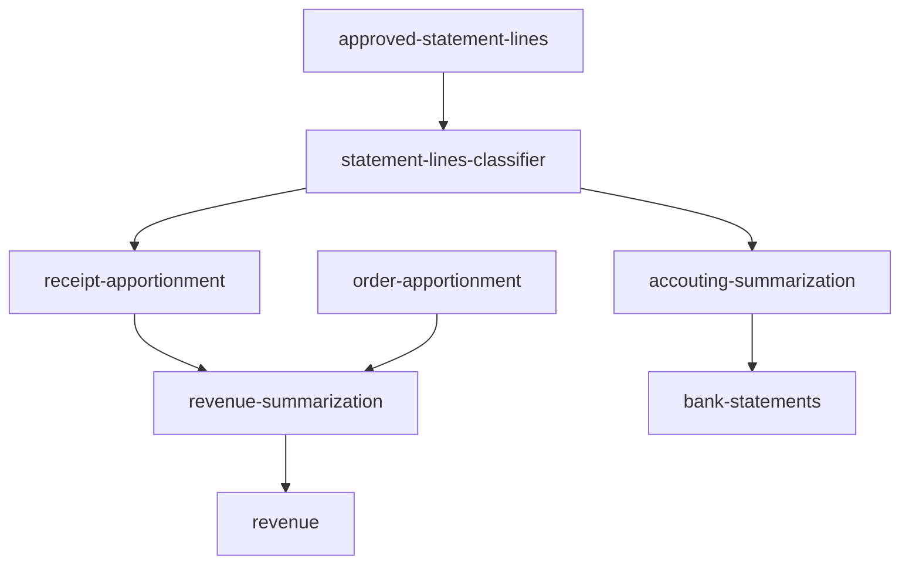

# Read Me First

The following App was developed as a part of the development cycle of Observable Streams functionalities collections,
and it is intended as a learning tool and reference guide.

# Data flow

#### Accounting Summarization

Summarizes all Apportionment Lines weekly, storing it in a circular queue per Account ID holding data
up to six months old.

Statement Lines uniqueness is guaranteed using a Bloom Filter — responsible for carrying statistic data
from the last two months.

#### Receipt Apportionment

Performs a distribution of all Statement Lines per Order-Account, in a ten-minute time window.
Forwards all Statement Lines outside the ten-minute window to the Accounting Apportionment. 

From:

| Statement Line | Account |      Baggage | Amount    |    Date    |
|:---------------|:-------:|-------------:|-----------|:----------:|
| 12             |    2    | 89, 115, 701 | $ 15.0000 | 2022-11-25 |
| 13             |    2    |       65, 15 | $ 09.3500 | 2022-11-26 |
| 19             |    2    |           65 | $ 01.8900 | 2022-11-26 |
| 25             |    2    |           18 | $ 19.3500 | 2022-11-27 |
| 102            |    7    |           18 | $ 39.3500 | 2022-11-27 |

To:

| Order | Account | Amount    | Statement Lines |    Date    |
|:------|:-------:|-----------|----------------:|:----------:|
| 89    |    2    | $ 05.0000 |              12 | 2022-11-25 |
| 115   |    2    | $ 05.0000 |              12 | 2022-11-26 |
| 701   |    2    | $ 05.0000 |              12 | 2022-11-26 |
| 65    |    2    | $ 06.5650 |          13, 19 | 2022-11-27 |
| 15    |    2    | $ 04.6750 |              13 | 2022-11-27 |
| 18    |    2    | $ 19.3500 |              25 | 2022-11-27 |
| 18    |    7    | $ 39.3500 |             102 | 2022-11-27 |

#### Revenue Summarization

It Summarizes all costs related to an Order in the ten-minute window, by grouping
together the receipt cost with all previous order-related costs.

#### Bank Statements

Holds reference for all Statement Lines for the current week, along with the resulting balance.

# Getting Started

### Running the App

There's a docker-compose file containing all needed dependencies. 

### Reference Documentation
For further reference, please consider the following sections:

* [Official Gradle documentation](https://docs.gradle.org)
* [Spring Boot Gradle Plugin Reference Guide](https://docs.spring.io/spring-boot/docs/3.0.0/gradle-plugin/reference/html/)
* [Create an OCI image](https://docs.spring.io/spring-boot/docs/3.0.0/gradle-plugin/reference/html/#build-image)
* [Distributed Tracing Reference Guide](https://micrometer.io/docs/tracing)
* [Getting Started with Distributed Tracing](https://docs.spring.io/spring-boot/docs/3.0.0/reference/html/actuator.html#actuator.micrometer-tracing.getting-started)
* [Spring Configuration Processor](https://docs.spring.io/spring-boot/docs/3.0.0/reference/htmlsingle/#appendix.configuration-metadata.annotation-processor)
* [Spring Boot Actuator](https://docs.spring.io/spring-boot/docs/3.0.0/reference/htmlsingle/#actuator)
* [Spring for Apache Kafka](https://docs.spring.io/spring-boot/docs/3.0.0/reference/htmlsingle/#messaging.kafka)
* [Apache Kafka Streams Support](https://docs.spring.io/spring-kafka/docs/current/reference/html/#streams-kafka-streams)
* [Apache Kafka Streams Binding Capabilities of Spring Cloud Stream](https://docs.spring.io/spring-cloud-stream/docs/current/reference/htmlsingle/#_kafka_streams_binding_capabilities_of_spring_cloud_stream)
* [Prometheus](https://docs.spring.io/spring-boot/docs/3.0.0/reference/htmlsingle/#actuator.metrics.export.prometheus)

### Guides
The following guides illustrate how to use some features concretely:

* [Building a RESTful Web Service with Spring Boot Actuator](https://spring.io/guides/gs/actuator-service/)
* [Samples for using Apache Kafka Streams with Spring Cloud stream](https://github.com/spring-cloud/spring-cloud-stream-samples/tree/master/kafka-streams-samples)

### Additional Links
These additional references should also help you:

* [Gradle Build Scans – insights for your project's build](https://scans.gradle.com#gradle)

